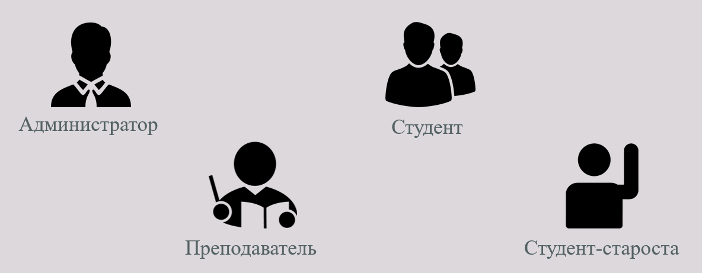
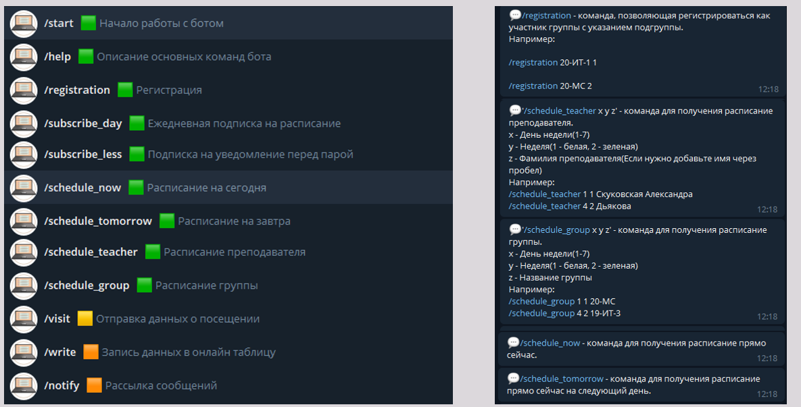
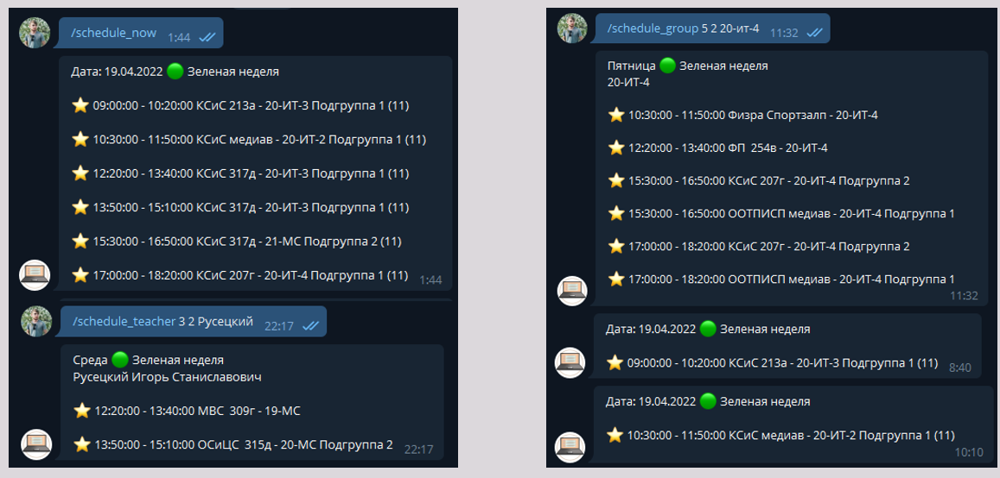

# PSU Bot Schedule

Телеграм-бот по рассылки расписания, а так же возможностью рассыклки уведомлений определенным группам/потокам/старостам/учащимся

Имеет [дополнительное приложение](https://github.com/NikDub/ScheduleHelp) для работы с базой данных

Так же имеется вводная [документация](Docs/ПЗ.pdf) и [презентация](Docs/present.pptx) для ознакомления с продуктом

Приложение имеет 4 уровня доступа с разными правами

# Интерфейс телеграмм-бота

